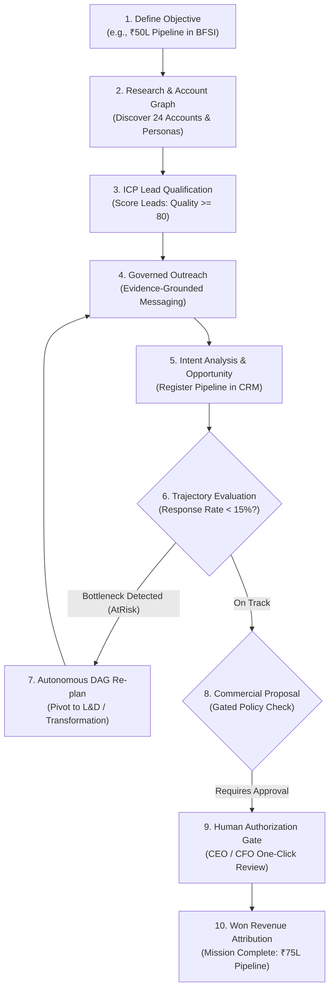

# BusinessModelApp — Workflow, Features & Credentials Guide

Welcome to the comprehensive reference for **BusinessModelApp** (JARVIS Revenue Operating System), a governed AI Business Operating System and autonomous revenue execution engine.

---

## 1. System Access & Default Credentials

### 🌐 Service Endpoints
| Component | URL | Notes |
| :--- | :--- | :--- |
| **Frontend Web App** | `http://localhost:3000` | React + TypeScript + Vite Cockpit |
| **Backend REST API** | `http://localhost:5000` | .NET 8 Web API |
| **Swagger API Docs** | `http://localhost:5000/swagger` | Interactive OpenAPI Explorer |
| **Database** | `businessmodelapp.db` | SQLite multi-tenant relational store |

---

### 🔑 Seeded User Accounts
All seeded accounts share the default password: **`Password123!`**

| Email | Role | Full Name | Primary Responsibilities / Permissions |
| :--- | :--- | :--- | :--- |
| **`mayur@bitbloom.in`** | **`CEO`** | Mayur Prabhune | **Full Executive Access** — Mission launch, wallet budgeting, high-value proposal authorization, system-wide analytics. |
| **`growth@bitbloom.in`** | **`Manager`** | Aarav Sharma | **Commercial Operations** — Lead management, CRM pipeline oversight, outreach inspection, campaign review. |
| **`cfo@bitbloom.in`** | **`CFO`** | Charles Finley | **FinOps & Financial Approvals** — AI inference budget allocation, wallet cap enforcement, cost attribution. |

> [!NOTE]
> Default Organization: **`Bitbloom Services Enterprise`** (`bitbloom-ai`)  
> Default Workspace: **`Commercial Operations & Growth`** (Currency: `INR`)

---

## 2. Platform Architecture & Key Features

```text
┌──────────────────────────────────────────────────────────────────────────────────────────┐
│                             JARVIS REVENUE OPERATING SYSTEM                              │
│         Active Missions: 1 | Generated Pipeline: ₹75.0L | AI Spend: ₹3.00 | ROI: 2.5Mx    │
└────────────────────────────────────────────┬─────────────────────────────────────────────┘
                                             │
                       ┌─────────────────────┴─────────────────────┐
                       ▼                                           ▼
       ┌───────────────────────────────┐           ┌───────────────────────────────┐
       │   COMMERCIAL REALITY LAYER    │           │  MISSION SUCCESS CONTROLLER   │
       │ • Account Graphs (EVD-*)      │           │ • Trajectory Evaluation Engine│
       │ • Multi-Persona Profiles      │           │ • Root Cause Hypothesis       │
       │ • Buying Center Dynamics      │           │ • Closed-Loop DAG Re-planning │
       │ • Governed Meeting Briefs     │           │ • Adaptive Strategy Pivots    │
       └───────────────┬───────────────┘           └───────────────┬───────────────┘
                       │                                           │
                       └─────────────────────┬─────────────────────┘
                                             ▼
       ┌───────────────────────────────────────────────────────────────────────────┐
       │                       ZERO-TRUST CONNECTOR PLANE                          │
       │  • GovernedWebSearchConnector         • GovernedEmailConnector (Draft/Send) │
       │  • GovernedCompanyIntelConnector      • GovernedCalendarConnector         │
       │  • GovernedProspectDiscoveryConnector • GovernedProposalEngineConnector   │
       │  • ConnectorConsent (Strict Scopes, Rate Limits & Hard DeleteRecords Ban) │
       └───────────────────────────────────────────────────────────────────────────┘
```

### 💎 Core Architectural Capabilities

1. **Revenue Mission Control (Hero Cockpit)**:
   - Real-time tracking of Active Missions, Pipeline Generated, Attributed Won Revenue, AI Execution Spend, and ROI Multipliers.
2. **Multi-Persona Account Graph (`AccountGraph.cs`)**:
   - Automatically synthesizes buying centers (CEO, CHRO, CIO, CTO, CDO, Head of L&D, VP of Transformation) with ICP fit scores and pain-point mappings.
3. **Zero-Trust Connector Plane (`ConnectorConsent.cs` & `RealWorldConnectors.cs`)**:
   - External tool sandbox with explicit consent scopes (`Read`, `WriteDraft`, `SendDirectOutreach`, `ScheduleCalendar`).
   - Hard security ban on `DeleteRecords` and per-tenant daily quota tracking.
4. **Mission Success Controller (`MissionSuccessController.cs`)**:
   - Calculates real-time trajectory health (`OnTrack`, `AtRisk`, `Replanning`, `Completed`).
   - Diagnoses conversion bottlenecks (e.g. low CIO response rate) and autonomously pivots DAG execution to high-converting personas (e.g., L&D and Transformation leaders).
5. **FinOps & Mission Wallets (`MissionWallet.cs`)**:
   - Strict budget reservation and financial spend caps per mission.
6. **Policy Engine & Gated Approvals (`AgentPolicyEngine.cs`)**:
   - Autonomy Levels 0 to 4.
   - High-value commercial commitments and contract terms trigger mandatory Executive Authorization gates.
7. **Verifiable Evidence Grounding (`EVD-*`)**:
   - All AI insights, meeting briefs, and proposals carry cryptographically traceable evidence identifiers.

---

## 3. End-to-End Autonomous Revenue Workflow

The autonomous revenue lifecycle operates as a closed-loop execution loop:



### Detailed Workflow Stages

| Stage | Agent / System Component | Action Description | Evidence Output |
| :--- | :--- | :--- | :--- |
| **1. Objective Intake** | `ChiefRevenueOfficerAgent` | Ingests target pipeline, sector, geography, wallet budget, and autonomy level. | `MSN-XXXX` |
| **2. Account Discovery** | `MarketIntelligence` & `ProspectDiscovery` | Synthesizes enterprise account graphs and maps decision makers across 7 core enterprise personas. | `EVD-MKT-*`, `EVD-ACC-*` |
| **3. Lead Qualification** | `SalesDevelopmentAgent` | Evaluates AI transformation demand, headcount, and budget fit. Scores ICP (0–100). | `EVD-QUAL-*` |
| **4. Governed Outreach** | `OutreachSpecialistAgent` | Dispatches personalized, compliant value propositions grounded in company evidence. | `EVD-OUT-*` |
| **5. Intent Analysis** | `RevenueNegotiatorAgent` | Classifies prospect responses (Positive, Objection, Info Request) and spawns CRM opportunities. | `EVD-CONV-*` |
| **6. Trajectory Check** | `MissionSuccessController` | Continuously monitors response rate and conversion metrics against milestone pacing. | Trajectory Report |
| **7. Closed-Loop Re-plan** | `MissionSuccessController` | Generates adaptive DAG tasks if bottlenecks are detected, re-routing outreach to alternative buying centers. | Augmented DAG |
| **8. Executive Gate** | `AgentPolicyEngine` | Halts execution before contract/pricing dispatch for high-value deals. | `APR-XXXX` |
| **9. Proposal Approval** | Human Reviewer (UI/API) | Authorizes commercial terms and releases held budget. | `Authorized` |
| **10. Revenue Won** | `AccountExecutiveAgent` | Reconciles wallet spend, records attributed pipeline, and marks mission complete. | Commercial ROI |

---

## 4. Verification & Testing Commands

### 🧪 Automated Test Suite (.NET)
Run all 65 unit and integration tests:
```powershell
dotnet test
```

---

### 🚀 Live End-to-End Simulation Script
Execute the full live revenue mission loop against the running server (`http://localhost:5000`):
```powershell
powershell -ExecutionPolicy Bypass -File "test_gate7_live.ps1"
```

**Expected Script Flow**:
1. Authenticates as `mayur@bitbloom.in`.
2. Launches ₹50L enterprise BFSI campaign.
3. Steps through Account Graph discovery and initial outreach.
4. Queries `/api/agentmissions/{id}/trajectory` for bottleneck diagnosis.
5. Invokes `/api/agentmissions/{id}/replan` to augment DAG tasks.
6. Approves gated proposal via `/api/agentmissions/{id}/approve-task/{taskId}`.
7. Validates **₹75,00,000 Pipeline Generated with ₹3.00 AI Spend (2.5M x ROI)**.

---

### 💻 Frontend Verification
Navigate to `new-frontend` directory:
```powershell
# TypeScript Typecheck
npm run typecheck

# ESLint Code Quality
npm run lint

# Production Build
npm run build

# Start Local Dev Server
npm run dev
```

---

## 5. Summary of Key Files

| Area | Key File | Purpose |
| :--- | :--- | :--- |
| **Core Models** | `src/BusinessModelApp.Core/Agents/AccountGraph.cs` | Account graph, multi-persona profiles & meeting briefs. |
| **Connectors** | `src/BusinessModelApp.Core/Connectors/ConnectorConsent.cs` | Zero-trust permissions and delete-blocking security rules. |
| **Connectors** | `src/BusinessModelApp.Infrastructure/Connectors/RealWorldConnectors.cs` | Governed implementations for Search, Intel, Email, and Calendar. |
| **Controller** | `src/BusinessModelApp.Core/Services/MissionSuccessController.cs` | Trajectory evaluation and closed-loop adaptive DAG re-planning. |
| **Orchestrator** | `src/BusinessModelApp.Core/Services/AgentOrchestratorService.cs` | Multi-agent DAG execution and gated task resolution. |
| **API** | `src/BusinessModelApp.Api/Controllers/AgentMissionsController.cs` | REST endpoints for missions, trajectory, re-planning, and approvals. |
| **UI - Cockpit** | `new-frontend/src/pages/Dashboard/index.tsx` | JARVIS Revenue Mission Control executive hero cockpit. |
| **UI - Swarm** | `new-frontend/src/pages/GrowthAgent/index.tsx` | Trajectory health badge, bottleneck alerts & DAG visualizer. |
| **Seeded Data** | `src/BusinessModelApp.Infrastructure/Data/SeedData.cs` | Default tenant, roles, users, and credentials. |
