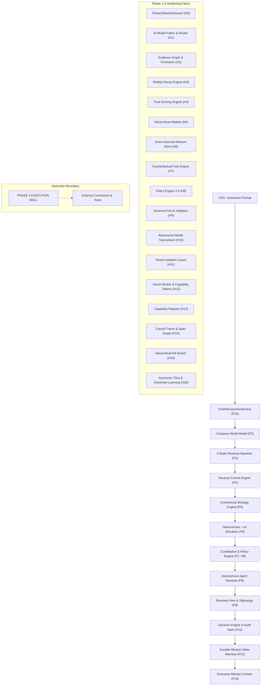
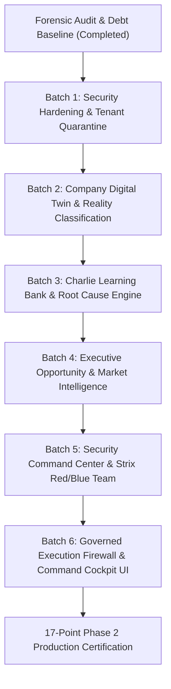

# Charlie Business OS — Phase 2 Forensic Architecture & Security Audit

**Document Version:** 2.0.0  
**Audit Date:** September 2026  
**Audited System:** Charlie Business OS (Backend: .NET 8, Frontend: React 18 / Vite / TypeScript, Storage: SQLite / SQL Server)  
**Current Certification Baseline:** 136 / 136 Tests Passing | Frontend Production Build Clean  
**Audit Scope:** Full codebase inspection (Core, Infrastructure, API, Data, AI Fabric, Security, Agent Runtime, Governance, Hive, UI, Observability)

---

## 1. Executive Summary & Audit Mandate

This forensic audit establishes the architectural, operational, and cybersecurity baseline of **Charlie Business OS** prior to the implementation of **Phase 2: Autonomous Intelligence, Learning Bank, Security Command Center & Governed Execution**.

### Absolute Audit Rules Enforced
1. **Zero Greenfield Rewrite:** All working P1–P14 gates and H0–H16 hardening layers are frozen.
2. **Deterministic Governance Invariant:** No AI model, agent, memory, connector, tool, or learning record may independently define business truth, acquire authority, spend money, or execute consequential real-world side effects without explicit constitutional and human governance.
3. **Execution Wall Integrity:** All autonomous tools and agent actions remain strictly bounded until passing through the Phase 2 Governed Execution Firewall.

---

## 2. Current Architecture Map



---

## 3. Existing Certified Capabilities Matrix (136 Tests Baseline)

| Gate Category | Certified Gates | Certified Invariants & Contracts | Status |
| :--- | :--- | :--- | :---: |
| **Phase 1 Baseline** | **P1 – P14** | `TruthMetric<T>` field-level evidence attribution; 4-state revenue baseline; 7-stage deterministic reverse funnel; 6-rule constitutional policy; persistent agent runtime; Munder Difflin stigmergy blackboard; SHA-256 decision records; durable mission checkpoint resume; 6-screen executive UI; Antarctica unknown-world anti-hallucination. | **CERTIFIED (96/96 Tests)** |
| **Phase 1.5 Batch 1** | **H0 – H3** | Architectural backward-compatibility guard; 4-tier model registry with deterministic mock gateway; multi-source evidence graph corroboration; exponential confidence reality decay. | **CERTIFIED (11/11 Tests)** |
| **Phase 1.5 Batch 2** | **H4 – H7** | Standardized agent cards with dynamic trust decay; 3-phase spend commit wallets; append-only event-sourced mission streams; counterfactual branch comparison. | **CERTIFIED (10/10 Tests)** |
| **Phase 1.5 Batch 3** | **H8 – H12** | Policy Framework 2.0 with strict conflict precedence; JSON schema output validation; 7-vector adversarial AI benchmarking; zero-trust tenant isolation; HMAC-SHA256 secret broker capability tokens. | **CERTIFIED (10/10 Tests)** |
| **Phase 1.5 Batch 4** | **H13 – H16 & Loop** | Dynamic connector capability registry; causal ancestry span tracing; 6-level hierarchical kill switch matrix; L0–L5 autonomy tier manager; continuous governed learning loop. | **CERTIFIED (9/9 Tests)** |
| **Total Test Suite** | **P1 – H16** | **136 passing tests, 0 failures, 0 skipped, 4s execution duration.** | **100% PASS** |

---

## 4. Forensic Vulnerability & Security Findings

### 4.1 Broken Object-Level Authorization (BOLA / IDOR) & Tenant Bypass in Controllers
- **Affected Files:**
  - `src/BusinessModelApp.Api/Controllers/ObjectivesController.cs` (Line 71): Hardcodes fallback to static GUID `00000000-0000-0000-0000-000000000001` if `WorkspaceId` is omitted, bypassing `UserContextService.GetAuthorizedWorkspaceIdAsync()`.
  - `src/BusinessModelApp.Api/Controllers/WorldModelController.cs` (Line 28): Hardcodes static workspace GUID `00000000-0000-0000-0000-000000000001`.
  - `src/BusinessModelApp.Api/Controllers/DecisionsController.cs` (Line 49): `_dbContext.DecisionRecords.OrderByDescending(d => d.DecidedAt).Take(20)` returns global decision records without scoping to the caller's tenant or workspace.
  - `src/BusinessModelApp.Api/Controllers/AgentMissionsController.cs` (Lines 69–85): `GetMissionById` and `ApproveGatedTask` retrieve and mutate missions by GUID without validating whether the mission belongs to the caller's workspace.
- **Severity:** **CRITICAL**
- **Impact:** Cross-tenant information disclosure and unauthorized mission task approval.
- **Remediation:** Enforce `IUserContextService` and `ITenantIsolationGuard` across all controller actions.

### 4.2 Hardcoded Fallback JWT Key & Insecure Password Configuration
- **Affected File:** `src/BusinessModelApp.Api/Program.cs` (Lines 96–132)
- **Vulnerability:**
  - `var jwtKey = builder.Configuration["Jwt:Key"] ?? "SecureSecretKeyForBusinessModelAppAuthentication2026";` (Line 109). If configuration is absent, tokens are signed using a known public string.
  - Password policy disables digit, lowercase, uppercase, and non-alphanumeric requirements with minimum length 6 (Lines 98–102).
  - `options.RequireHttpsMetadata = false;` (Line 120) allows unencrypted token transmission.
- **Severity:** **HIGH**
- **Impact:** Token forgery if default key is deployed; brute-force credential vulnerability.
- **Remediation:** Enforce cryptographic key generation from secure environment variables, fail startup if missing in production, enable HTTPS metadata requirement, and tighten password complexity.

### 4.3 Missing Global Query Filters in EF Core Data Layer
- **Affected File:** `src/BusinessModelApp.Infrastructure/Data/AppDbContext.cs`
- **Vulnerability:** Multi-tenant entities (`Lead`, `Opportunity`, `AuditEvent`, `EvidenceRecord`, `DecisionRecord`, `DurableMission`) lack EF Core `HasQueryFilter` definitions. Any LINQ query omitting `.Where(e => e.WorkspaceId == ...)` leaks records across workspaces.
- **Severity:** **HIGH**
- **Remediation:** Implement automatic tenant/workspace filtering via `HasQueryFilter` tied to `ITenantContextAccessor`.

### 4.4 Incomplete Append-Only Audit Interceptor Coverage
- **Affected File:** `src/BusinessModelApp.Infrastructure/Interceptors/AppendOnlyAuditInterceptor.cs` (Line 31)
- **Vulnerability:** Interceptor protects `AuditEvent`, `Activity`, `BusinessActivity`, and `AICallRecord`, but does NOT protect `DecisionRecord`, `EvidenceRecord`, or `MissionCheckpoints` against modification or deletion.
- **Severity:** **HIGH**
- **Remediation:** Add `DecisionRecord`, `EvidenceRecord`, and `DurableMissionCheckpoint` to the immutable entity validation list.

### 4.5 Synthetic Reality Generation Fallback in GovernedToolRegistry
- **Affected File:** `src/BusinessModelApp.Core/Agents/GovernedToolRegistry.cs` (Line 187)
- **Vulnerability:** When `_prospectDiscovery == null`, the tool registry generated synthetic strings `$"EVD-SEARCH-{Guid.NewGuid()}"` and mock payload JSON, conflicting with the master rule: *Never create synthetic reality*.
- **Severity:** **HIGH**
- **Remediation:** Refactor `GovernedToolRegistry` to route all external capability requests strictly through the `CapabilityRegistryService` and `ExecutionFirewall` without synthetic fallback.

### 4.6 Missing Security Headers & Exception Masking
- **Affected File:** `src/BusinessModelApp.Api/Program.cs` (Lines 280–296)
- **Vulnerability:** Missing `Content-Security-Policy` (CSP), `Strict-Transport-Security` (HSTS), and global exception handler middleware. Unhandled server exceptions can leak stack traces to API consumers.
- **Severity:** **MEDIUM**
- **Remediation:** Add comprehensive OWASP security headers middleware and centralized exception handler returning sanitized RFC 7807 problem details.

---

## 5. Learning Subsystem Weaknesses & Gaps

1. **Absence of Unified Learning Bank Subsystem:**
   - Current implementation (`GovernedLearningLoop`) is restricted to prompt candidates and shadow fidelity.
   - Lacks persistent models for: `LearningRecord`, `LearningEpisode`, `FailureRecord`, `CorrectionRecord`, `OutcomeRecord`, `Lesson`, `Hypothesis`, `Experiment`, `LearningEvidence`.
2. **Missing Delta & Error Detection Engine:**
   - No automated mechanism compares `ExpectedOutcome` vs `ActualOutcome` (e.g. predicted conversion 25% vs actual 11%).
   - Root cause analysis across the 11 failure vectors (bad evidence, stale evidence, incorrect assumption, model reasoning, agent behavior, tool behavior, strategy, market change, human intervention, policy restriction, unknown) is not yet codified.
3. **Missing Multi-Tier Learning Hierarchy (L0 – L5):**
   - L0 Session $\to$ L1 Mission $\to$ L2 Agent $\to$ L3 Organizational $\to$ L4 Strategic $\to$ L5 Validated Institutional.
   - Need governed promotion gates requiring evidence and human sign-off before lessons can influence organizational strategy.
4. **Missing Learning Decay & Retrieval Filtering:**
   - Lessons do not age through states: `ACTIVE` $\to$ `AGING` $\to$ `STALE` $\to$ `SUPERSEDED` $\to$ `REJECTED`.
   - Pre-mission strategy formulation does not query a contextual `LearningBundle` to explain *"Why Charlie learned this."*

---

## 6. Architecture Gaps for Phase 2

1. **Company Digital Twin (Part 3):**
   - Upgrade `WorldModel` into an enterprise-wide `DigitalTwin` encompassing 22 business dimensions (Financial, Commercial, Delivery, Employees, Inventory, Suppliers, Connectors, Market Signals, Risks).
   - Strict category classification: `FACT`, `ESTIMATE`, `HYPOTHESIS`, `OBSERVATION`, `LEARNING`, `UNKNOWN` must be modeled as first-class discriminators.
2. **Charlie Evaluation Engine & Model Tournament (Parts 9 & 10):**
   - Expand `IAIEvaluationEngine` into `ICharlieEvaluationEngine` to evaluate mission outcomes, strategy quality, reasoning correctness, tool selection, and policy compliance.
3. **Opportunity & Market Intelligence Engine (Parts 12 & 13):**
   - Codify the continuous pipeline: `Signal` $\to$ `Hypothesis` $\to$ `Evidence Collection` $\to$ `Verification` $\to$ `Opportunity` $\to$ `Commercial Scoring` $\to$ `Simulation` $\to$ `Recommendation`.
   - External market radar capturing competitors, pricing, regulatory shifts, and sentiment with strict non-fact attribution.
4. **Security Command Center & Red Team / Blue Team Harness (Parts 14–22):**
   - Unified security cockpit displaying security score, attack surface, finding lifecycle, kill switches, and tenant isolation status.
   - Controlled Red Team testing harness inspired by Strix architecture, executing against sandboxed testbeds for prompt injection, memory poisoning, RAG poisoning, authority escalation, and tool abuse.
   - Strict Audit Mode subsystem that halts feature execution and locks audit trails.
5. **Governed Execution Firewall (Part 24):**
   - Unbreakable multi-stage gate before external connector dispatch:
     `Agent -> Capability Request -> Policy Engine -> Authority Check -> Tenant Check -> Budget Check -> Risk Check -> Human Approval -> Execution Firewall -> Connector Adapter -> External System`.

---

## 7. Dependency Graph & Technical Baseline

```text
Backend:
- Microsoft.NET.Sdk 8.0
- Microsoft.EntityFrameworkCore 8.0.0 (Sqlite & SqlServer)
- Microsoft.AspNetCore.Authentication.JwtBearer 8.0.0
- Microsoft.AspNetCore.Identity.EntityFrameworkCore 8.0.0
- StackExchange.Redis 2.8.0
- Swashbuckle.AspNetCore 6.5.0
- xUnit 2.5.3, FluentAssertions, Moq

Frontend:
- React 18.2.0, Vite 4.4.9, TypeScript 5.2.2
- Material-UI (@mui/material 5.14.9, @mui/icons-material 5.14.9)
- TanStack React Query 4.35.3
- Axios 1.5.0, Dayjs 1.11.9
```

---

## 8. Recommended Implementation Sequence

To maintain continuous certification and zero regressions, Phase 2 will execute in 6 logical batches:



1. **Batch 1 (Security Hardening & Tenant Quarantine):** Fix BOLA/IDOR in controllers; enforce `ITenantIsolationGuard` on all endpoints; add `HasQueryFilter` in EF Core; expand `AppendOnlyAuditInterceptor` to `DecisionRecord` and `EvidenceRecord`; remove fallback JWT secrets.
2. **Batch 2 (Company Digital Twin):** Implement `CompanyDigitalTwin` spanning 22 business entities with immutable truth categorization (`FACT`, `ESTIMATE`, `HYPOTHESIS`, `OBSERVATION`, `LEARNING`, `UNKNOWN`).
3. **Batch 3 (Charlie Learning Bank & Delta Engine):** Build `LearningBank`, `LearningRecord`, `FailureRecord`, `CorrectionRecord`, `OutcomeDeltaEngine`, L0–L5 learning tiers, learning decay horizon, and pre-mission learning retrieval bundle.
4. **Batch 4 (Opportunity & Market Intelligence):** Build continuous `OpportunityIntelligenceEngine` and `MarketIntelligenceEngine` linking external signals with evidence-backed commercial scoring.
5. **Batch 5 (Security Command Center & Red Team Harness):** Implement `SecurityCommandCenter`, Strix-inspired `CharlieRedTeam` adversarial sandbox, finding lifecycle (`OPEN` $\to$ `VALIDATED` $\to$ `MITIGATED` $\to$ `RESOLVED`), and Strict Audit Mode.
6. **Batch 6 (Governed Execution Firewall & Executive UI Cockpit):** Build `GovernedExecutionFirewall` with multi-stage verification; update frontend with Executive Command Center, Learning Center, and Security Command Center.

---

## 9. Comprehensive Certification Plan

Each batch will produce certified unit, invariant, and integration tests:
- `Baseline Invariant Tests`: Ensure all 136 Phase 1 / Phase 1.5 tests remain 100% green.
- `Security Invariant Tests`: Verify cross-tenant isolation, BOLA prevention, and secret broker capability token protection.
- `Learning Invariant Tests`: Verify learning decay, anti-poisoning, and prohibition of unverified lessons defining truth.
- `Anti-Hallucination Antarctica Tests`: Verify unknown data points return `UNKNOWN` without synthesis.
- `Execution Firewall Tests`: Verify no tool dispatch occurs without satisfying all 8 firewall checks.
- `Frontend Build Verification`: Verify `tsc && vite build` transforms cleanly without warnings or errors.
