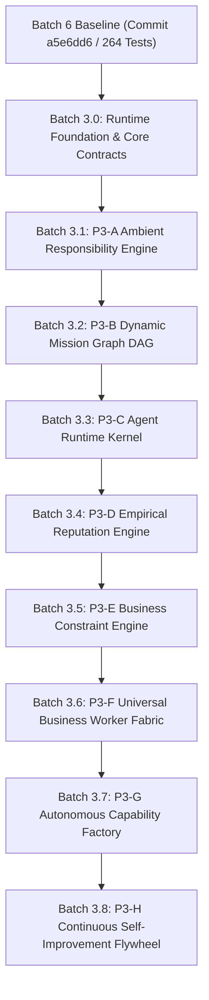

# CHARLIE BUSINESS OS — PHASE 3 MASTER ARCHITECTURE & IMPLEMENTATION ROADMAP

**Document Version:** 3.0.0  
**Status:** Active Master Specification  
**Baseline Certification:** 264 / 264 Tests Passing (Commit `a5e6dd6`)  
**Scope:** Phase 3: The Autonomous Business Runtime & Continuous Operations  

---

## 1. Executive Summary & North Star

### 1.1 The Fundamental Paradigm Shift
Phase 3 transforms Charlie Business OS from:
> **A governed AI system capable of executing approved missions**

into:
> **A continuously operating, self-monitoring, self-improving Business Agent Operating System.**

The core execution loop shifts from reactive user prompting to an autonomous business lifecycle:
$$\text{Observe} \rightarrow \text{Establish Reality} \rightarrow \text{Detect Constraint} \rightarrow \text{Plan} \rightarrow \text{Simulate} \rightarrow \text{Govern} \rightarrow \text{Execute} \rightarrow \text{Verify} \rightarrow \text{Measure} \rightarrow \text{Explain} \rightarrow \text{Learn} \rightarrow \text{Re-evaluate} \rightarrow \text{Improve}$$

### 1.2 The Sovereign Invariant
> **Charlie may become more autonomous, but it may never become less governed.**

Under no circumstances may any Phase 3 runtime kernel, mission DAG, ambient worker, or self-improvement loop bypass, downgrade, or weaken the Batch 6 Execution Firewall.

---

## 2. Phase 3 Architecture Map

```text
                         CEO / BUSINESS OWNER
                                │
                                ▼
                 ┌────────────────────────────┐
                 │ P3-A AMBIENT RESPONSIBILITY│
                 │ Persistent responsibilities│
                 │ SLAs • thresholds • events │
                 └─────────────┬──────────────┘
                               │
                               ▼
                 ┌────────────────────────────┐
                 │ P3-E BUSINESS CONSTRAINT   │
                 │ Bottleneck detection       │
                 │ Growth equation            │
                 └─────────────┬──────────────┘
                               │
                               ▼
                 ┌────────────────────────────┐
                 │ P3-B MISSION GRAPH ENGINE  │
                 │ Dynamic DAG • dependencies │
                 │ parallelism • verification │
                 └─────────────┬──────────────┘
                               │
                               ▼
                 ┌────────────────────────────┐
                 │ P3-C AGENT RUNTIME KERNEL  │
                 │ lifecycle • workload       │
                 │ capabilities • health      │
                 └─────────────┬──────────────┘
                               │
                               ▼
                 ┌────────────────────────────┐
                 │ P3-D AGENT REPUTATION      │
                 │ empirical performance      │
                 │ accuracy • cost • trust    │
                 └─────────────┬──────────────┘
                               │
                               ▼
                 ┌────────────────────────────┐
                 │    CHARLIE BRAIN FABRIC    │
                 │ OpenRouter • Direct • Local│
                 │ reasoning only             │
                 └─────────────┬──────────────┘
                               │
                               ▼
══════════════════════════════════════════════════════════════
          BATCH 6 EXECUTION FIREWALL — FROZEN
                 AUTHORITY ≠ INTELLIGENCE
══════════════════════════════════════════════════════════════
                               │
                               ▼
                 ┌────────────────────────────┐
                 │ P3-F BUSINESS WORKER FABRIC│
                 │ API • MCP • Browser • SaaS │
                 │ Desktop • Legacy           │
                 └─────────────┬──────────────┘
                               │
                               ▼
                 ┌────────────────────────────┐
                 │ OUTCOME / VERIFICATION     │
                 │ Predicted vs Actual        │
                 └─────────────┬──────────────┘
                               │
                               ▼
                 ┌────────────────────────────┐
                 │ P3-H SELF-IMPROVEMENT      │
                 │ Causal learning • eval     │
                 │ red team • certification   │
                 └────────────────────────────┘
```

---

## 3. The 8 Implementation Batches

Rather than building all eight subsystems simultaneously, Phase 3 executes across 8 structured, dependency-ordered batches:



---

### Batch 3.0 — Runtime Foundation & Core Contracts
**Goal:** Establish all Phase 3 architecture contracts, identifiers, state models, and scheduling abstractions before any autonomous behavior is wired.

* **Core Identifiers & DTOs:**
  - `ResponsibilityId`, `MissionGraphId`, `AgentInstanceId`, `CapabilityId`, `ExecutionIntentId`.
* **State Machines & Enums:**
  - Standardized lifecycle state contracts for responsibilities, graphs, agents, and intents.
* **Telemetry & Traceability:**
  - Mandatory propagation of `CorrelationId`, `CausationId`, `WorkspaceId`, and `TraceSpanId`.
* **Infrastructure Abstractions:**
  - `ISchedulerEngine`: High-precision, durable, tenant-aware timer and event trigger abstraction.
  - `IEventBus`: Append-only, idempotent in-process / distributed event bus.
  - `IPhase3TenantIsolationGuard`: Enforces zero-trust cross-tenant segregation across background workers.
* **Critical Invariant:**
  - Batch 6 components remain 100% untouched. No Phase 3 foundation contract gets direct access to external connectors.
* **Gate:** **P3.0-G01** (264 / 264 tests preserved, 0 regressions).

---

### Batch 3.1 — P3-A Ambient Responsibility Engine
**Goal:** Transition Charlie from *prompt-driven* to *responsibility-driven* operations.

* **Core Responsibility Model:**
  ```text
  Responsibility
   ├── Owner / Tenant
   ├── Business Domain (CashFlow, Sales, Margin, Ops, SLA)
   ├── Metric & Threshold Condition
   ├── Cadence (RealtimeEvent, Hourly, Daily, Weekly)
   ├── Priority & Escalation Policy
   ├── Risk Ceiling (R0–R5) & Budget Ceiling
   ├── Authority Ceiling
   ├── Mission Template
   └── Kill State
  ```
* **Trigger Modalities:**
  - Metric threshold breach (e.g., DDO receivables $> 42$ days).
  - Threshold drift (moving average deterioration $> 15\%$).
  - Event triggers (CRM webhook, refund spike, SLA breach).
  - Reality decay (evidence staleness $> 48$ hours).
* **Hard Invariant:**
  - A responsibility may **propose a mission**; it cannot directly dispatch external execution.

---

### Batch 3.2 — P3-B Dynamic Mission Graph (DAG)
**Goal:** Replace linear single-track mission flows with dynamic, parallel, and self-healing task graphs.

* **Node Topology:**
  $$\text{PERCEPTION} \rightarrow \text{REALITY\_CHECK} \rightarrow \text{HYPOTHESIS} \rightarrow \text{ANALYSIS} \rightarrow \text{SIMULATION} \rightarrow \text{DECISION} \rightarrow \text{APPROVAL} \rightarrow \text{EXECUTION} \rightarrow \text{VERIFICATION} \rightarrow \text{OUTCOME}$$
* **Control Flow Nodes:** `Retry`, `Fork`, `Join`, `HumanWait`, `Compensation`, `Rollback`, `Escalation`, `Cancel`.
* **Dynamic Branching:** If verification fails or evidence contradicts assumptions, the DAG dynamically forks a diagnostic sub-graph within pre-reserved budget bounds.
* **Hard Invariant:**
  - **Dynamic DAG $\neq$ Dynamic Authority.** The graph may alter its reasoning path, but all execution nodes must pass through the Batch 6 Execution Firewall.

---

### Batch 3.3 — P3-C Agent Runtime Kernel
**Goal:** Transform agents from stateless role strings into managed runtime processes.

* **Process Lifecycle:**
  $$\text{CREATED} \rightarrow \text{READY} \rightarrow \text{RUNNING} \rightarrow \text{WAITING} \rightarrow \text{BLOCKED} \rightarrow \text{AWAITING\_HUMAN} \rightarrow \text{COMPLETED}$$
  Terminal/Fault States: `SUSPENDED`, `TERMINATED`, `FAILED`, `RETIRED`.
* **Kernel Supervisors:**
  - Heartbeat & lease management.
  - Crash recovery & automatic checkpoint hydration.
  - Concurrency & workload ceiling enforcement.
  - Tenant memory isolation.

---

### Batch 3.4 — P3-D Agent Reputation Engine
**Goal:** Establish an empirical, merit-based routing market for agents based on verified real-world outcomes.

* **Empirical Metrology Dimensions:**
  - Accuracy & outcome quality.
  - Policy & security violation count (instant trust degradation).
  - Hallucination rate & synthetic data penalties.
  - Cost efficiency & latency predictability.
  - Rollback / compensation frequency.
* **Deterministic Scoring:**
  $$\text{Utility} = \frac{\text{Historical Accuracy} \times \text{Outcome Quality} \times \text{Trust Tier}}{\text{Unit Cost} \times \text{Latency} \times (1 + \text{Hallucination Rate})}$$
* **Hard Invariant:**
  - **Reputation influences model selection and routing; it NEVER elevates execution authority.**

---

### Batch 3.5 — P3-E Business Constraint Engine
**Goal:** Apply Eliyahu Goldratt's Theory of Constraints (ToC) to identify the single critical bottleneck in the business and focus agent intelligence there.

* **Constraint Identification Across 22 Dimensions:**
  - Evaluates Revenue, Margin, Retention, CAC, AOV, Collections, Inventory, Capacity, SLA.
* **Constraint Record:**
  - Current Value, Target Value, Gap, Causal Confidence, Financial Exposure, Time Sensitivity, Controllability, and Recommended Mission.
* **Significance:** Prevents multi-agent chaos by steering organizational intelligence toward the enterprise bottleneck.

---

### Batch 3.6 — P3-F Universal Business Worker Fabric
**Goal:** Provide standardized worker interfaces across disparate systems while strictly enforcing the Execution Firewall.

* **Worker Modalities:**
  - **API:** REST, GraphQL, Webhooks, SaaS platforms.
  - **MCP:** Governed Model Context Protocol servers with capability scoping.
  - **Browser:** Headless Chromium / Playwright with visual confirmation and DOM validation.
  - **Desktop / Legacy:** Governed RPA and local system automation.
* **Architectural Flow:**
  $$\text{Agent} \rightarrow \text{Capability Request} \rightarrow \text{Mission DAG} \rightarrow \text{Policy Engine} \rightarrow \text{Execution Firewall} \rightarrow \text{Worker Adapter} \rightarrow \text{External System}$$

---

### Batch 3.7 — P3-G Autonomous Capability Factory
**Goal:** Enable Charlie to detect capability deficiencies and synthesize, test, and sandbox new tools without human coding—while strictly forbidding self-delegation of authority.

* **Capability Synthesis Loop:**
  $$\text{Gap Detected} \rightarrow \text{Specification} \rightarrow \text{Code Gen} \rightarrow \text{Sandbox} \rightarrow \text{Unit/Integ Tests} \rightarrow \text{Strix Red Team} \rightarrow \text{Human Certification} \rightarrow \text{Registry}$$
* **Absolute Invariant:**
  - **Capability may evolve; Authority may NEVER evolve.** Charlie can create a new tool, but that tool remains subject to the same Execution Firewall and human sign-off policies.

---

### Batch 3.8 — P3-H Continuous Self-Improvement Flywheel
**Goal:** Close the loop between real-world results and organizational cognition.

* **Continuous Improvement Cycle:**
  $$\text{Experience} \rightarrow \text{Outcome Delta} \rightarrow \text{Root Cause Analysis} \rightarrow \text{Learning Candidate} \rightarrow \text{Adversarial Eval} \rightarrow \text{Promotion} \rightarrow \text{Production Influence}$$
* **Epistemic Invariant:**
  - **MEMORY $\neq$ LEARNING $\neq$ KNOWLEDGE $\neq$ TRUTH $\neq$ POLICY.**
  - An agent cannot write directly into system truth or policy based on experience; lessons must clear promotion thresholds and human review.

---

## 4. Phase 3 Autonomy Ladder

Phase 3 extends the formal L0–L5 autonomy ladder:

| Level | Capability Description | Human Governance Required |
| :---: | :--- | :--- |
| **L0** | **Observe:** Collect metrics, read Digital Twin, monitor reality. | Zero human friction. Read-only. |
| **L1** | **Analyze:** Detect anomalies, calculate variance, evaluate drift. | Zero human friction. Read-only. |
| **L2** | **Recommend:** Formulate strategic options, simulate counterfactuals. | Zero human friction. Advisory only. |
| **L3** | **Prepare Mission:** Decompose goals into dynamic DAGs, reserve budgets. | Zero human friction. Pre-execution staging. |
| **L4** | **Bounded Reversible Execution:** Execute R0–R1 side-effects within micro-budgets. | Autonomous within strict time/scope leases. |
| **L5** | **Governed Autonomous Operations:** Ambient multi-agent operation across delegated responsibilities. | Human sets constitution, budget ceilings, and signs off on R3+ actions. |

---

## 5. Frontend Evolution: Charlie Executive Mission Control

The user interface in `new-frontend` will expand from the static cockpit into a living Operations Center:

1. **Ambient Responsibilities View:** Active watchdogs, triggered thresholds, health status, and escalation states.
2. **Dynamic Mission Graph (Visual DAG):** Live interactive directed graph showing node states (`Perception`, `Hypothesis`, `Simulation`, `Execution Permit`, `Verification`).
3. **Agent Fleet Cockpit:** Managed process monitors showing agent heartbeat, memory, workload, empirical reputation, and unit cost efficiency.
4. **Constraint Radar:** Real-time visualization of the primary enterprise bottleneck and intelligence allocation.
5. **Autonomous Activity & Provenance Feed:** Full transparency log explaining:
   *What happened? What did Charlie believe? What evidence was used? Under what authority? What was the outcome? What was learned?*

---

## 6. Negative Scope: What Charlie Will NOT Build

To maintain architectural purity and avoid the "generic agent OS" trap:
- ❌ **NO** dozens of unverified toy agents.
- ❌ **NO** unbounded browser or shell access.
- ❌ **NO** speculative cryptocurrency wallets or tokenized agent bidding.
- ❌ **NO** autonomous modification of execution policies or constitutions.
- ❌ **NO** self-elevation of risk tiers or spend ceilings.
- ❌ **NO** autonomous deployment of unverified capabilities directly into production.

---

## 7. Master Execution Sequence

```text
CURRENT BASELINE: Commit a5e6dd6 (264 / 264 PASS, Frontend Clean)
       │
       ▼
Batch 3.0: Runtime Foundation & Core Contracts (P3.0-G01)
       │
       ▼
Batch 3.1: Ambient Responsibility Engine (P3.1-G01)
       │
       ▼
Batch 3.2: Dynamic Mission Graph DAG (P3.2-G01)
       │
       ▼
Batch 3.3: Agent Runtime Kernel (P3.3-G01)
       │
       ▼
Batch 3.4: Empirical Agent Reputation Engine (P3.4-G01)
       │
       ▼
Batch 3.5: Business Constraint Engine (P3.5-G01)
       │
       ▼
Batch 3.6: Universal Business Worker Fabric (P3.6-G01)
       │
       ▼
Batch 3.7: Autonomous Capability Factory (P3.7-G01)
       │
       ▼
Batch 3.8: Continuous Self-Improvement Flywheel (P3.8-G01)
       │
       ▼
PHASE 4: Autonomous Enterprise Network & Omnichannel Operations
```
